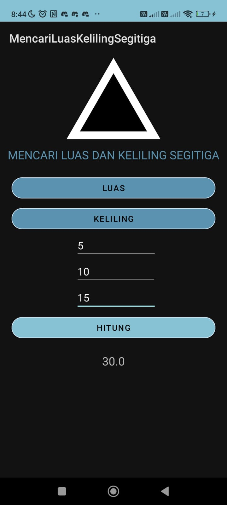
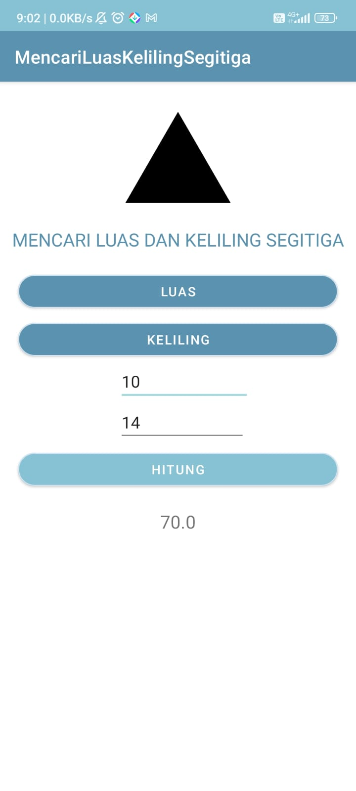

## Screenshots

### Dark Mode

### Light Mode

Screenshots were taken on a Poco M3 Pro 5G & Poco F5 5G with the following specifications:
###Dark Mode
- Device: Poco M3 Pro 5G
- Processor: Dimensity 700 
- RAM: 6GB
- Storage: 128GB
- Modes: Dark Mode

- ###Light Mode
- Device: Poco F5 5G
- Processor: Snapdragon 7+ Gen 2
- RAM: 12GB
- Storage: 256GB
- Modes: Light Mode
